# Managing the Database
Databases are responsible for storing literally everything except lot and object data. If you want to modify what's in there then you'll need to use a client program to connect to it and modify it (in most cases a GUI one). In this guide I'll show you how to connect to your server's database using DBeaver, an open source GUI database client.

## Setting up DBeaver

1. Installing DBeaver  
You can find the download links to DBeaver [here](https://dbeaver.io/download/)
> [!NOTE]
> There are TWO versions of DBeaver, there's Community Edition which is free and it'ss what I linked here ([dbeaver.io](https://dbeaver.io)) but there's also a paid, commercial version available over at [dbeaver.com](https://dbeaver.com)

2. Connecting DBeaver to MariaDB  
After you first open up DBeaver, you'll be prompted if you want to create a sample database, say no to that.

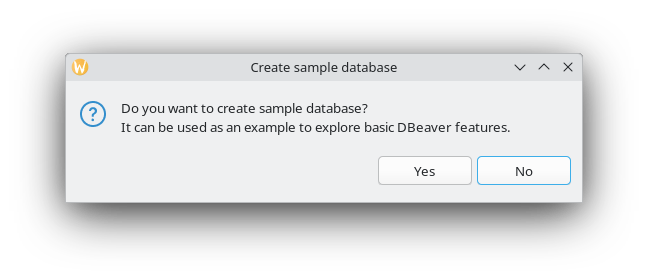

Clicking `No` opens up the `Connect to a database` window, inside of it click on `MariaDB` and then `Next`.

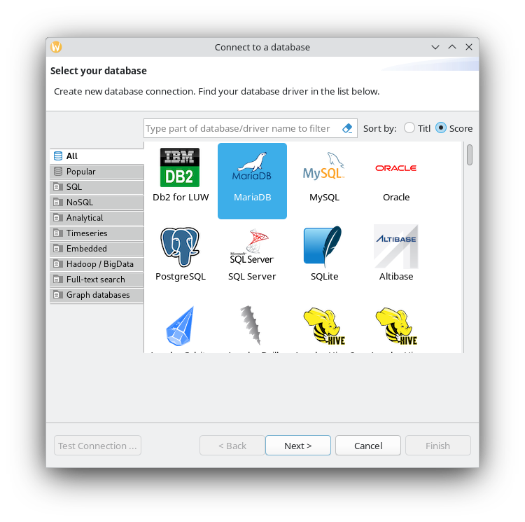

Then put in the same connection details as you did in your `config.json`
> [!IMPORTANT]
> You **SHOULD NOT** port forward your database port, you should at most use a VPN to connect to it if you can't use LAN

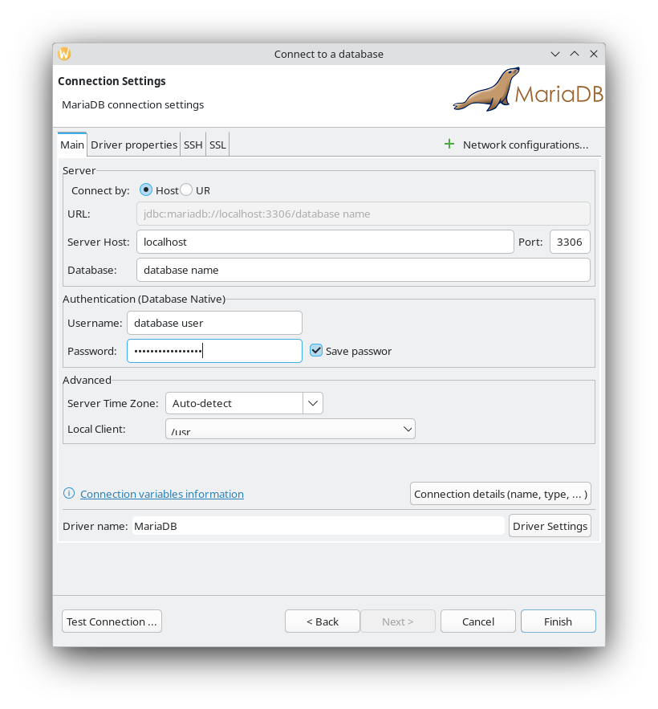

---

Congratulations, you can modify your database all you want
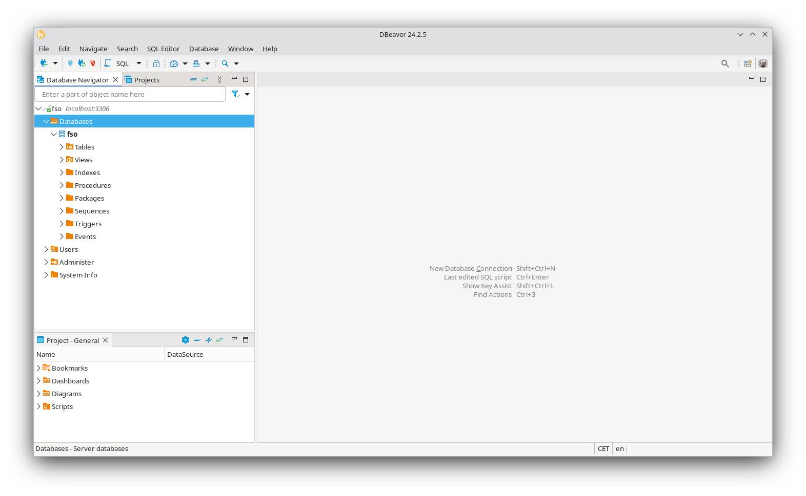

## Managing users
You can find info about users (accounts) in `fso_users` table
> [!IMPORTANT]
> Remember to hit CTRL+S to save your changes

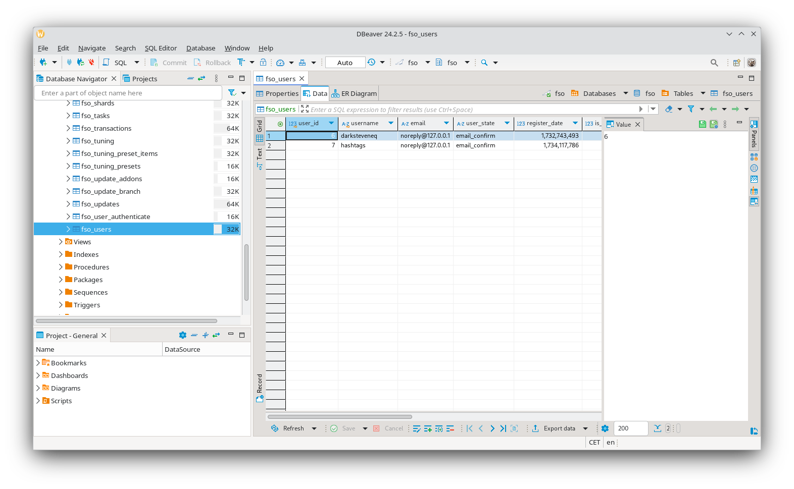

If you want to give a user an admin or a moderator status, you can change their `is_admin` and `is_moderator` values from `0` to `1`

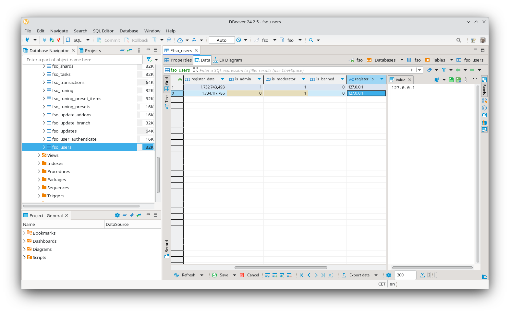

If you want to remove some user, you can just delete their row with Delete. When you do, you should also remove their password hash in `fso_user_authenticate`.

## Changing city map
You can change the map used by the city by modifying its row in `fso_shards`
> [!IMPORTANT]
> Remember to hit CTRL+S to save your changes

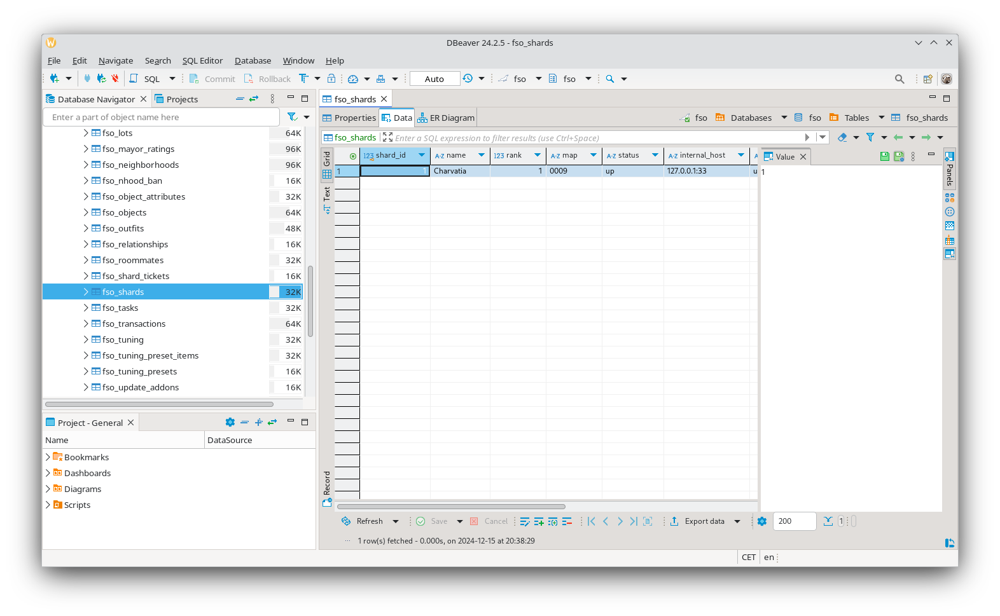

`name` column controls the name that displays in the city select for example. It can be anything.  
`map` is the ID of the map to render, here's a list of all default ones!

### TSO Maps
- `0001` - Blazing Falls (may not load)
- `0002` - Alphaville
- `0003` - Test Center (preducesor of FreeSO's Sunrise Crater)
- `0004` - Interhogan
- `0005` - Ocean's Edge
- `0006` - East Jerome
- `0007` - Fancey Fields
- `0008` - Betaville
- `0009` - Charvatia
- `0010` - Dragon's Cove
- `0011` - Rancho Rizzo
- `0012` - Zavadaville
- `0013` - Queen Margaret's
- `0014` - Shannopolis
- `0015` - Grantley Grove
- `0016` - Calvin's Creek
- `0017` - The Billabong
- `0018` - Mount Fuji
- `0019` - Dan's Grove
- `0020` - Jolly Pines
- `0021` - Yatesport
- `0022` - Landry Lakes
- `0023` - Nichol's Notch
- `0024` - King Canyons
- `0025` - Virginia Islands
- `0026` - Pixie Point
- `0027` - West Darrington
- `0028` - Upper Shankelston
- `0029` - Albertstown
- `0030` - Terra Tablante

### Custom maps
- `0100` - Sunrise Crater

For this example I'll replace `Charvatia` with `City Name` and change its ID to Sunrise Crater's
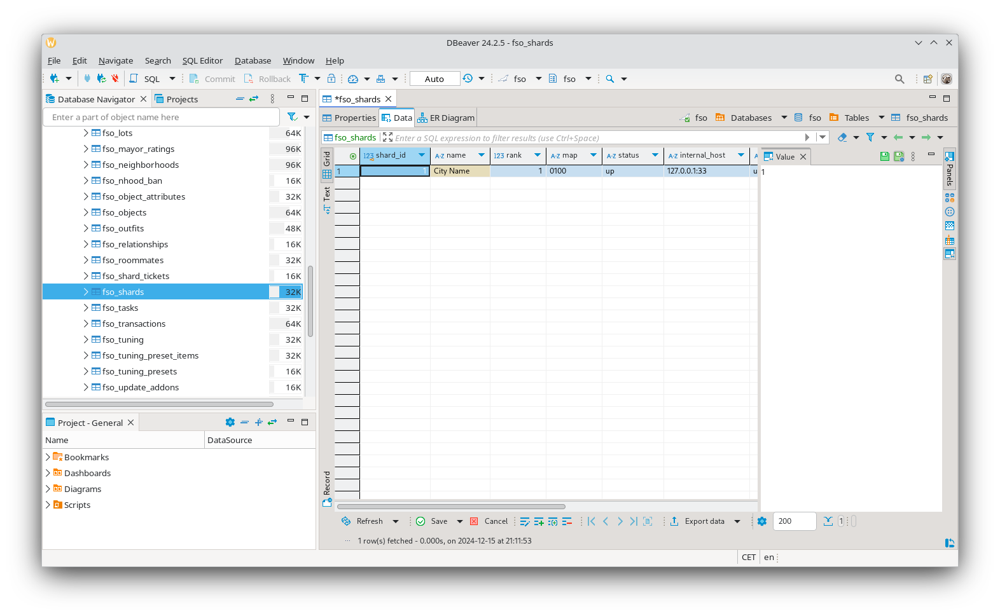

Here are the in-game effects
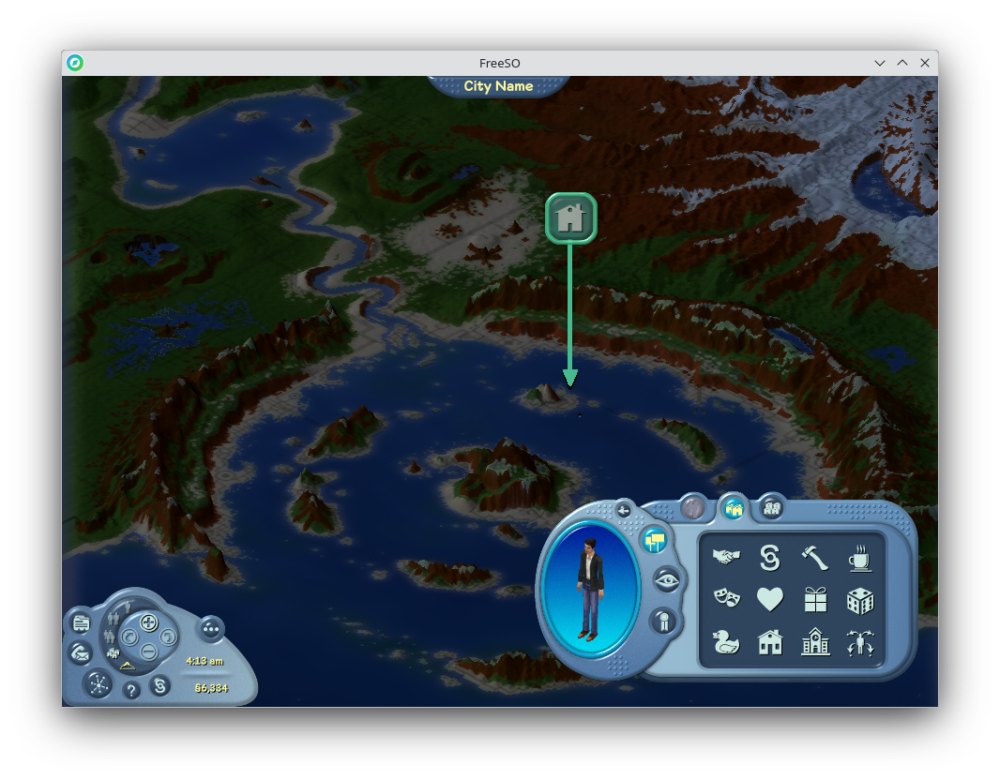

Also take note to **NOT** change maps in production unless you want floating lots
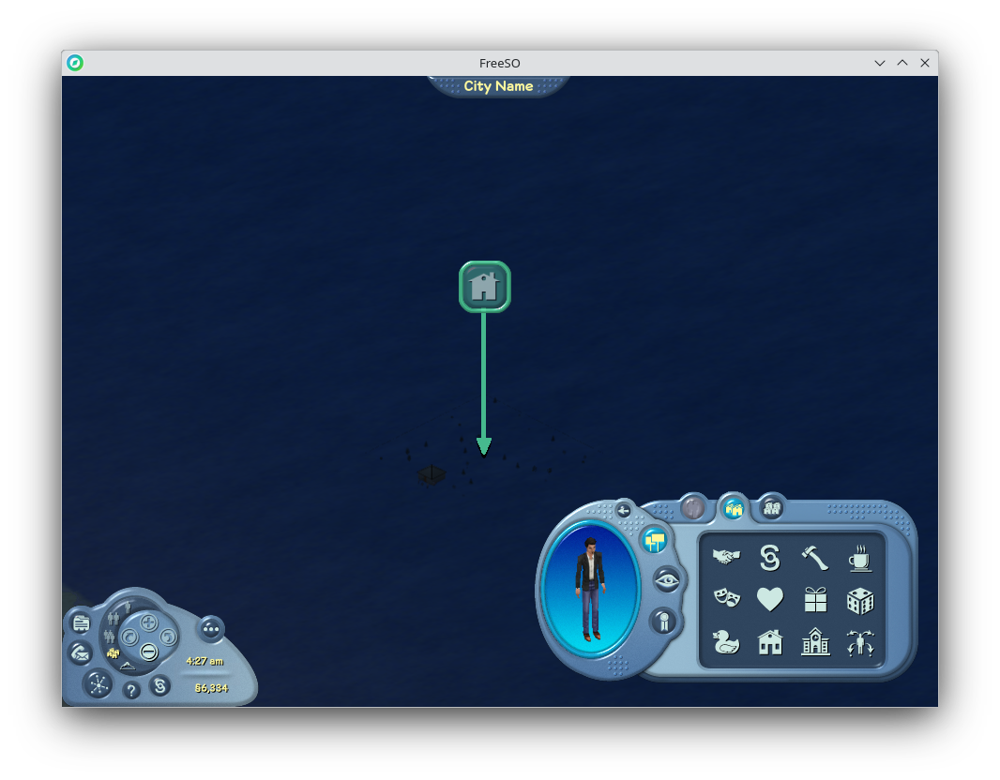

## Adding multiple cities
Adding multiple cities is a bit tideous, but possible.
> [!IMPORTANT]
> Remember to hit CTRL+S to save your changes

First of, you'll need to insert a new row into the `fso_shards` table, you can do that with Alt+Insert. Here are the some examples of setting the values
- `shard_id` *should* be right after the previous index, `name` can be whatever you'd like
- `rank` does... something
- `map` is the ID of a map you want to use
- `status` controls visible status in Select a City
  - `up` - City shows up as online with status `Ok`
  - `down` - City shows up as offline with status `Full`, doesn't allow for sim creation
  - `busy` - City shows up as offline with status `Busy`, trying to select it will show a `City is Busy` dialog box and it'll block the creation button.
  - `full` - City shows up as offline with status `Full`, trying to select it will show a `City is Full` dialog box and it'll block the creation button.
  - `closed` - Acts exactly the same as `down`
  - `frontier` - City shows up as offline with status `Ok`, trying to select it will show a `City Not Available` dialog box (`You are allowed only one Sim per city.`) and it'll block the cration button.
- in both "host" columns only the ports matter (not sure about `internal_host` but from what I understand it has something to do with multi-server setups, `public_host` does some funny magic to automatically point to your server no matter the IP/domain)

All the remaining columns can be left blank since the server will override version-related ones and `update_id` can be left blank.

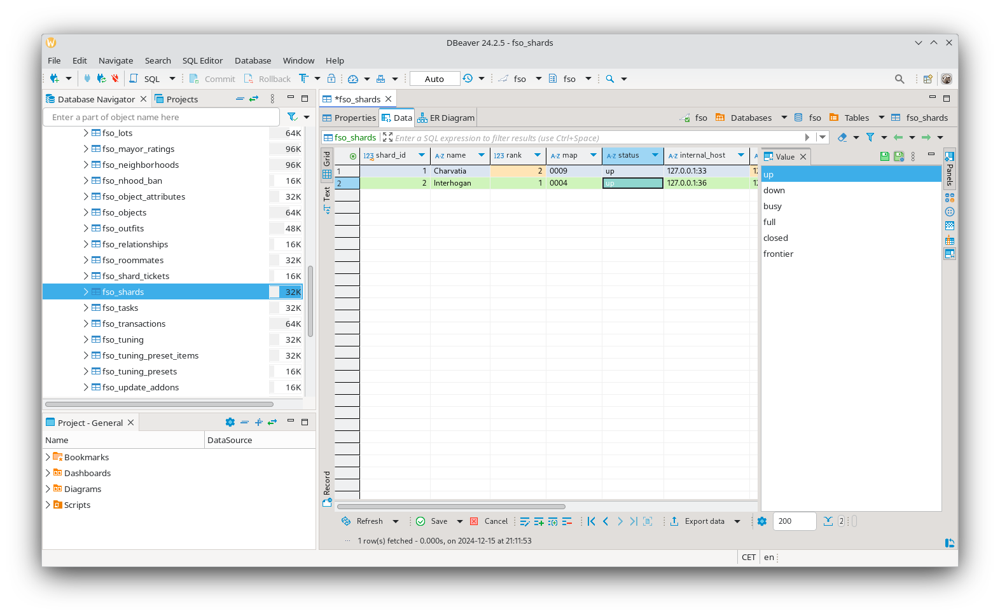

Once you added the second city entry to the database you can actually add it to your `config.json`. To do that you... can literally copy the entry for the previous city and modify it like this

```json
"cities": [
    {
        "call_sign": "ganymede",
        "id": 1,
        ...
    },
    {
        "call_sign": "jupiter",
        "id": 2,
        "binding": "0.0.0.0:36100",
        "internal_host": "127.0.0.1:36",
        "public_host": "0.0.0.0:36",

        "maintenance":{
            "cron":"0 4 * * *",
            "timeout":3600,
            "visits_retention_period":7,
            "top100_average_period": 4
        }
    }
]
```

A city server is nothing when you can't play on it (no lot server assigned). To add your new city to a lot server, go to its section of the config like this

```json
"lots": [
    {
        "cities": [
            {
                "id": 1,
                "host":"0.0.0.0:33100"
            },
            {
                "id": 2,
                "host": "0.0.0.0:36100"
            }
        ],
        ...
    }
]
```

Once you've done you should be able to see and connect to the new city

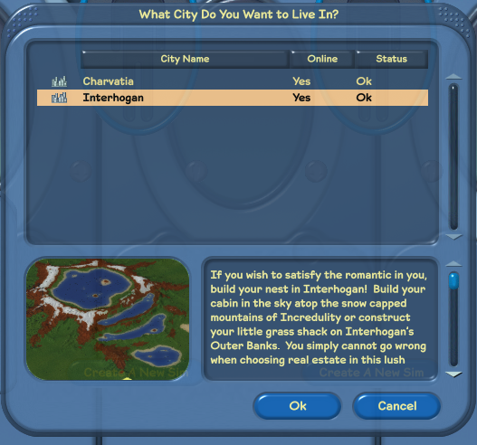
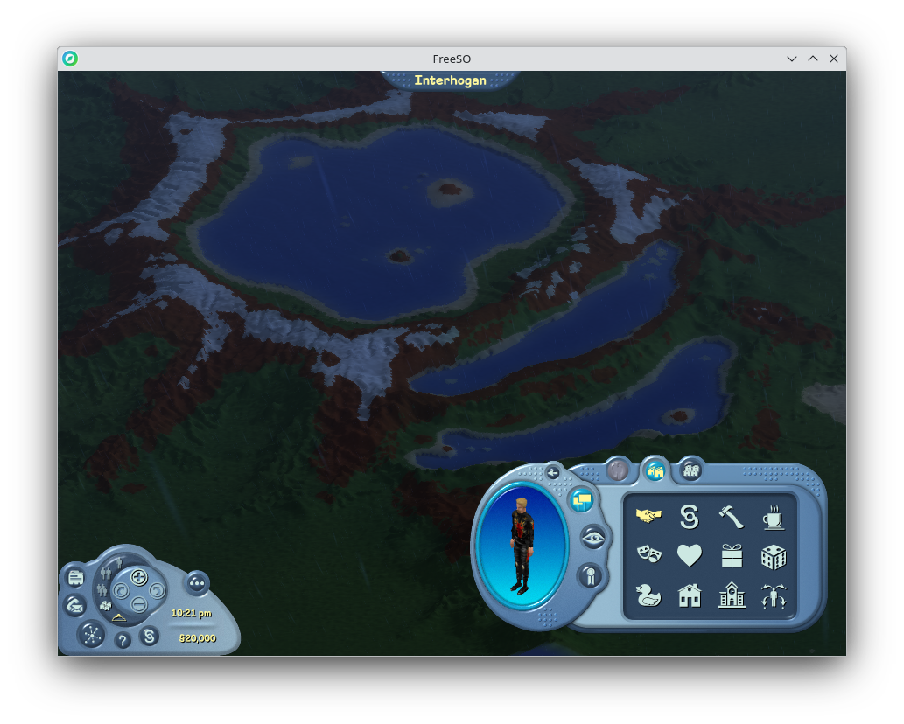

## Deleting sims
In order to delete sims, go to `fso_avatars` table, select the row of the avatar you want to remove and press Delete. The changes should be reflected in-game right away.
> [!IMPORTANT]
> Remember to hit CTRL+S to save your changes

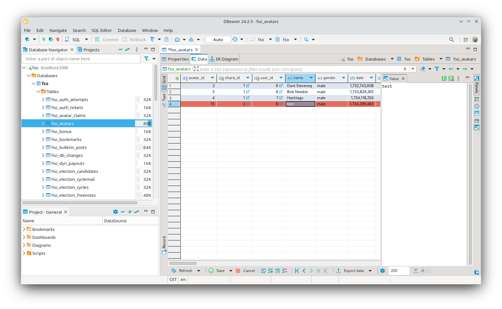
As you might've also seen, you can change one's name, account balance, skills (and locks) along with other stuff.
